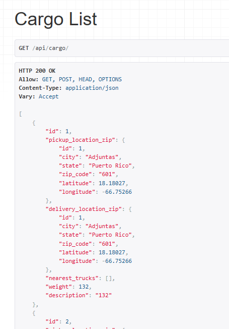
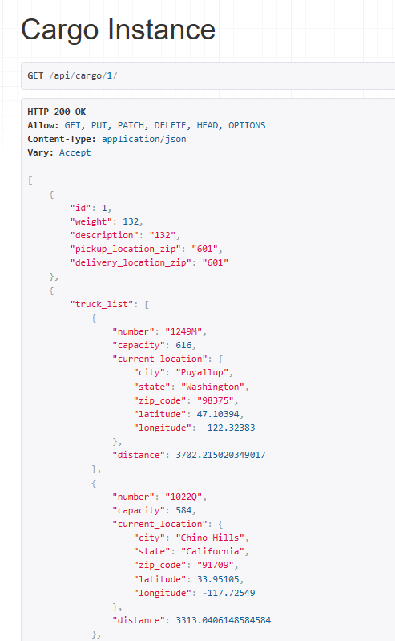
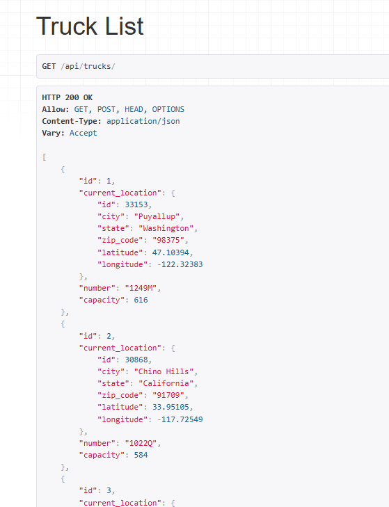
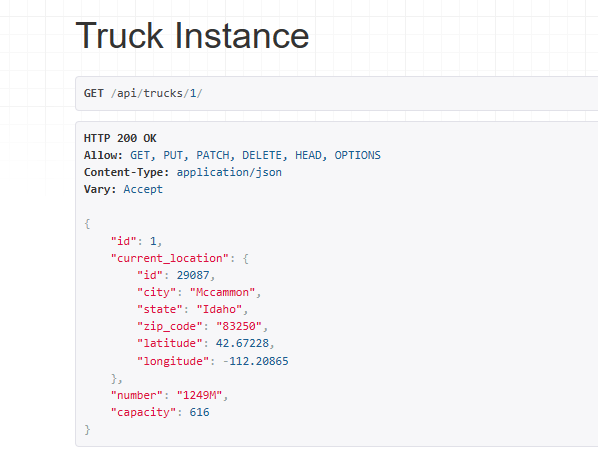
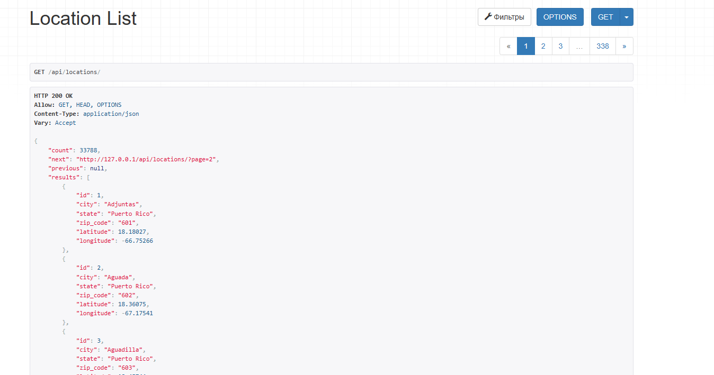

# DeliveryTestCase (Middle)

[TestCase(Middle).docx](TestCase(Middle).docx)

## Используемые библиотеки/фреймворки:

- [Docker](https://www.docker.com/)
- [Django](https://www.djangoproject.com/)
- [PostgreSQL](https://www.postgresql.org/)
- [Celery](https://docs.celeryq.dev/en/stable/)
- [Nginx](https://nginx.org/ru/)
- [Redis](https://redis.io/)

## Installation

```shell
docker compose up --build
```

## API documentations

- Swagger - http://localhost:8000/swagger

- Redoc - http://localhost:8000/redoc

## Examples









